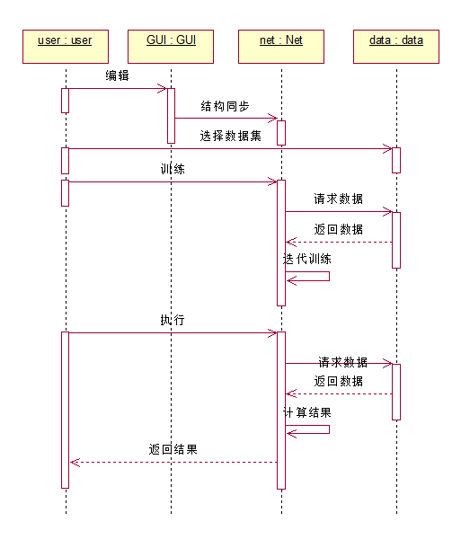
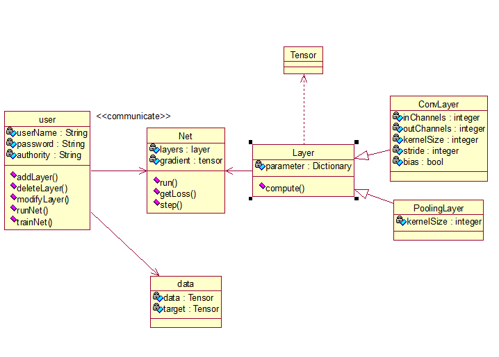
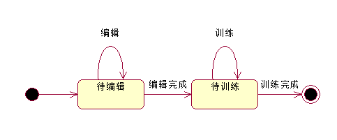
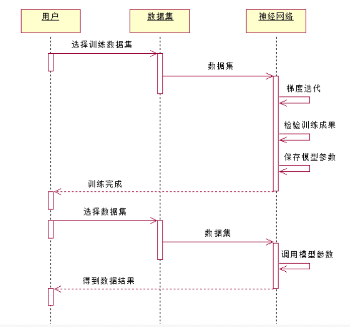
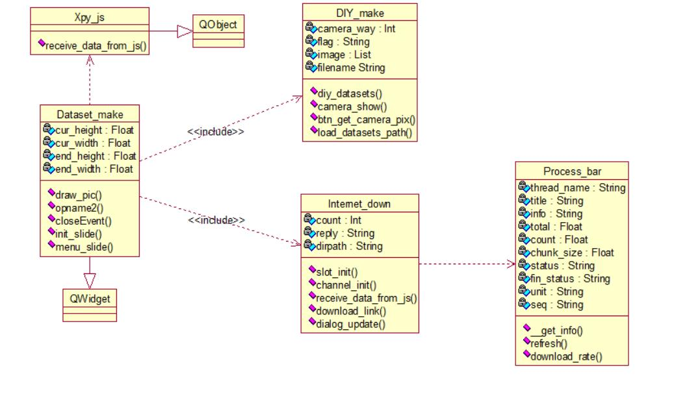

vitorch
==============

# 引言

## 编写目的

ViTorch以图形化界面为工具,通过图形编辑实现对神经网络的编辑,测试,训练,云端存储等功能,让用户从高难度,高强度的代码编写任务重解脱出来,使其有更多的精力研究模型本身,而非耗费大量的时间在模型的编辑任务上,从而提高研究效率,降低神经网络应用的门槛,为全民AI的时代添砖加瓦.

## 项目背景

传统的神经网络框架都是基于代码的,这就要求了使用者不仅要对神经网络有一定程度的了解,还必须拥有一定的代码基础,并且同时还需要花费较多的时间在学习代码框架上.然而,使用图形化编辑可以快速高校的完成以上工作.实现了类似从“dos”命令行到“windows”命令窗口的跨越.ViTorch以图形化界面为工具让用户从高难度,高强度的代码编写任务重解脱出来,提高研究效率,降低神经网络应用的门槛.

## 业务模式

开源项目，只为更好的造福人类（peach！！！）

# 用户需求

# 业务逻辑和数据流图

首先，用户开始编辑属于自己的神经网络，接着对神经网络进行测试，若出现异常则更改神经网络直至通过，接着挑选数据集，同时检验数据集的输入输出维度是否和神经网络符合，如果不符合的话，重新选择数据集或者重新编辑神经网络，最后进行不断的训练，直至神经网络的精度达到一定的标准，或者到训练速度放缓的基本为0时结束。

我们的ViTorch系统，使用一些基本的网络层来搭建网络模型，并可以在挑选的数据集上进行训练和预测。    

# 数据调查及分析

## 原始数据

## 数据字典

### 数据条目

### 数据分析

### 数据说明

# 系统需求

用户主要执行着图形编辑和运行神经网络这两项任务，其中图形编辑任务包括增加神经网络，更改神经网络，删除神经网络和导出神经网络四个操作。而运行神经网络有训练神经网络和使用神经网络两种，他们有相同的选择数据集合得到数据结果这两个共同的过程，但训练神经网络还需要对得到的数据结果进行梯度迭代和对训练成果进行检验两部分。

用户先在图形界面上编辑神经网络的框架，同时，这些图形会和神经网络的结构相同步，接着，用户选择将要使用的数据集，然后再这数据集上对神经网络进行训练，训练完成后，就可以在数据集上测试训练的效果和得到unlabel的样本的预测值。

 用户具有基本的属性，如用户名，密码和授权等级，同时能执行增加网络层，删除网络层，更改网络层，训练网络和使用网络等功能，其中用户的操作面向两类对象，一类是数据，另一类是网络，对网络的话，网络是由多个网络层组成的，可以运行结果，得到误差并存储各参数对误差的梯度以及更新梯度，对于组成网络的网络层，他有多种继承，如卷积网络，pooling，batchnorm等等。而对于数据集的话，他是由data和对每个data的标注target组成的。

对于神经网络的话，他就只经过了两种状态，待编辑，待训练，就到了最后的训练完成的神经网络的状态。

==对于选择数据集的部分我们继续展开，在选择数据集之后，数据集被调用神经网络，神经网络进行梯度迭代，检验训练成果，最后保存模型参数，或者可以使用原有的模型参数计算得到数据结果。==

